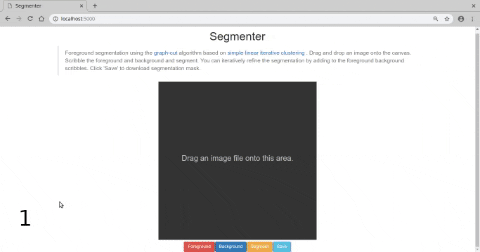

# Segmenter



Segmenter is a generic tool using Flask and python on the server and p5js on the client to do segmentation, offloading most heavy computation to the server.  

The program uses SLIC (the skimage implementation) superpixels to over-segment the image.
Users scribble on the foreground and background, using which the program builds a graph from the super-pixels and performs a minimum cut on this graph (using pyMaxflow).  
Most of the code comes from [this blog post](http://www.morethantechnical.com/2017/10/30/revisiting-graph-cut-segmentation-with-slic-and-color-histograms-wpython/).  

### Requirements:
1. Python
2. Flask
4. numpy
5. pyMaxflow
6. opencv
7. scikit-image  

Run as:
``` 
python server.py
```
And open a browser to [http://localhost:5000](http://localhost:5000)
